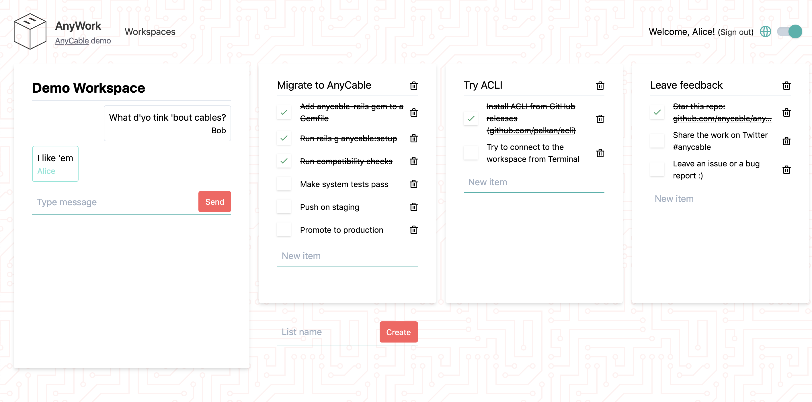

# AnyCable Rails Demo

This repository contains the code for AnyCable Rails demo application and its different variations.

[List of all demonstration PRs](https://github.com/anycable/anycable_rails_demo/pulls?q=is%3Apr++label%3Ademo+)



## Installation

This branch has a minimal number of dependencies to make it easier to run the project locally: SQLite instead of Postgres, no Redis, no Docker.

You need Ruby and NodeJS installed on your local machine (and maybe some common system deps for such gems as nokogiri and sqlite3).

```sh
bundle install
yarn install
bin/setup
```

## Running

You can start Rails server by running:

```sh
bundle exec rails s
```

Then go to [http://localhost:3000/](http://localhost:3000/) and see the application in action.

## Testing

We use RSpec for testing:

```sh
bundle exec rspec
```

**NOTE:** System tests require Chrome browser to be installed on your machine (no other software required).

## Resources

- [RuboCoping with legacy](https://evilmartians.com/chronicles/rubocoping-with-legacy-bring-your-ruby-code-up-to-standard)—this is how we configure RuboCop.
- [Evil Front](https://evilmartians.com/chronicles/evil-front-part-3)—some frontend ideas are borrowed from this post.
- [Ruby Next](https://evilmartians.com/chronicles/ruby-next-make-all-rubies-quack-alike)—we're using the edge Ruby syntax!
- [System of a test](https://evilmartians.com/chronicles/system-of-a-test-setting-up-end-to-end-rails-testing)—our system tests setup.

## Aknowledgements

Built and tested with the help of these awesome technologies:

- [Tailwind CSS](https://tailwindcss.com)
- [StimulusJS](https://stimulusjs.org)
- [Cuprite](https://github.com/rubycdp/cuprite) & [Browserless](https://www.browserless.io)

## Contributing

Bug reports and pull requests are welcome on GitHub at [https://github.com/anycable/anycable_rails_demo](https://github.com/anycable/anycable_rails_demo).

## License

The application is available as open source under the terms of the [MIT License](http://opensource.org/licenses/MIT).
