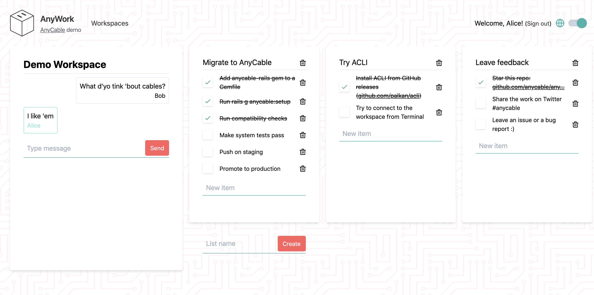

# AnyCable Rails Demo

This repository contains the code for AnyCable Rails demo application and its different variations.

[List of all demonstration PRs](https://github.com/anycable/anycable_rails_demo/pulls?q=is%3Apr++label%3Ademo+)



## Installation

This app has a Docker-first configuration based one the [Ruby on Whales post](https://evilmartians.com/chronicles/ruby-on-whales-docker-for-ruby-rails-development).

You need:

- Docker installed.

For MacOS just use [official app](https://docs.docker.com/engine/installation/mac/).

- [Dip](https://github.com/bibendi/dip) installed.

Run the following command to build images and provision the application:

```sh
dip provision
```

## Running

You can start Rails server along with AnyCable by running:

```sh
dip up web
```

Then go to [http://localhost:3000/](http://localhost:3000/) and see the application in action.

## Deploying with Kamal 2
Copy the sample files and fill in your values:

```bash
cp .env.sample .env
cp .kamal/secrets.sample .kamal/secrets
```

#### Environment variables

| Variable                  | Description                                                                                      |
| ------------------------- |--------------------------------------------------------------------------------------------------|
| `WEB_HOSTS`               | Comma-separated hosts for Rails web servers                                                      |
| `RPC_HOSTS`               | Comma-separated AnyCable RPC server hosts                                                        |
| `WS_HOSTS`                | Comma-separated hosts for the AnyCable Go                                                        |
| `REDIS_HOST`              | Redis server host                                                                                |
| `DB_HOST`                 | PostgreSQL host (e.g. `db.example.com`)                                                          |
| `PROXY_HOST`              | Public web domain (e.g. `anycable.example.com`)                                                  |
| `WS_PROXY_HOST`           | WebSocket proxy domain (e.g. `websocket.example.com`)                                            |
| `WS_ALLOWED_ORIGINS`      | Comma-separated list of hostnames to check the Origin header (e.g. `*.example.com`)              |
| `KAMAL_REGISTRY_SERVER`   | Docker registry hostname (e.g. `registry.digitalocean.com`)                                      |
| `KAMAL_REGISTRY_USERNAME` | Username for the Docker registry                                                                 |
| `KAMAL_REGISTRY_PASSWORD` | Password the Docker registry                                                                     |
| `POSTGRES_PASSWORD`       | Password for the `postgres` user                                                  |
| `DATABASE_URL`            | Postgres connection url (e.g. `postgres://postgres:<POSTGRES_PASSWORD>@<DB_HOST>:5432/<dbname>`) |
| `REDIS_PASSWORD`          | Redis password                                                                                   |
| `RUBY_VERSION`            | Ruby version (default `3.3.0`)                                                                   |
| `PG_MAJOR`                | PostgreSQL major version                                                                         |
| `NODE_MAJOR`              | Node.js major version                                                                            |
| `YARN_VERSION`            | Yarn version  (default `latest`)                                                                 |
| `APP_USER`                | Non-root user in Docker containers (default `app_user`)                                          |
| `RAILS_MASTER_KEY`        | Content of `config/credentials/production.key`                                                   |


Follow the [Kamal 2 installation guide](https://kamal-deploy.org/docs/installation/) to get started.

Build and deploy:

```bash
kamal setup
```

Follow the [Kamal 2 commands](https://kamal-deploy.org/docs/commands/view-all-commands/) to get the full list of commands or invoke

```bash
kamal help
```

#### Generating credentials.yml.enc

Before your first deploy, you must create the encrypted credentials file. From your project root, run:

```bash
RAILS_ENV=production bin/rails credentials:edit
```


## Debugging

If you want to run Rails server and/or with debugging capabilities, run the following commands:

```sh
# for Rails server
dip rails s
```

## Testing

We separate unit and system specs and provide convenient Dip commands to run them:

```sh
# only unit tests
dip rspec

# only system tests
dip rspec system
```

## Resources

- [Ruby on Whales](https://evilmartians.com/chronicles/ruby-on-whales-docker-for-ruby-rails-development)—learn about the Docker development setup used for this application.
- [RuboCoping with legacy](https://evilmartians.com/chronicles/rubocoping-with-legacy-bring-your-ruby-code-up-to-standard)—this is how we configure RuboCop.
- [Evil Front](https://evilmartians.com/chronicles/evil-front-part-3)—some frontend ideas are borrowed from this post.
- [Ruby Next](https://evilmartians.com/chronicles/ruby-next-make-all-rubies-quack-alike)—we're using the edge Ruby syntax!
- [System of a test](https://evilmartians.com/chronicles/system-of-a-test-setting-up-end-to-end-rails-testing)—our system tests setup.

## Aknowledgements

Built and tested with the help of these awesome technologies:

- [Tailwind CSS](https://tailwindcss.com)
- [StimulusJS](https://stimulusjs.org)
- [Cuprite](https://github.com/rubycdp/cuprite) & [Browserless](https://www.browserless.io)

## Contributing

Bug reports and pull requests are welcome on GitHub at [https://github.com/anycable/anycable_rails_demo](https://github.com/anycable/anycable_rails_demo).

## License

The application is available as open source under the terms of the [MIT License](http://opensource.org/licenses/MIT).
